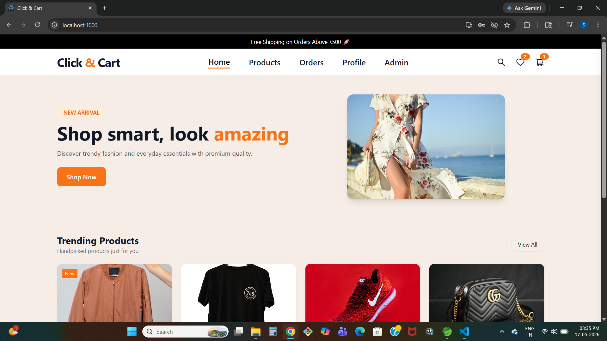
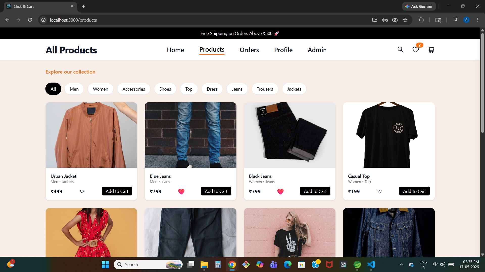
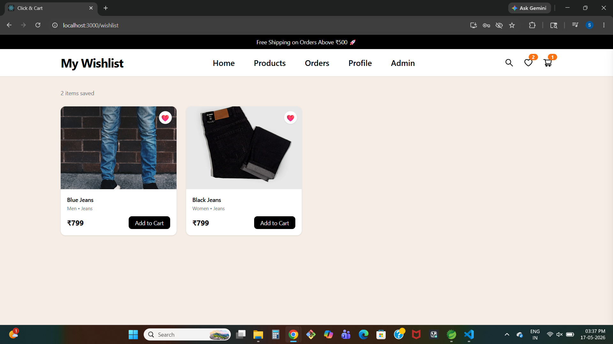
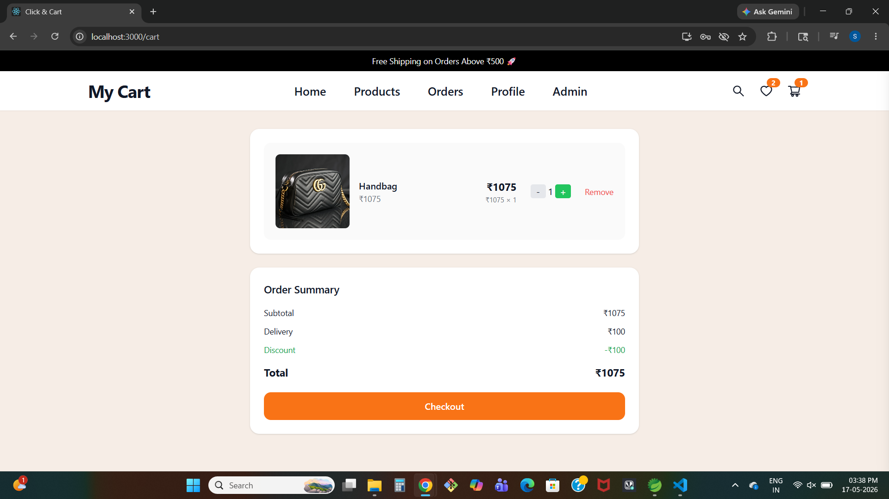
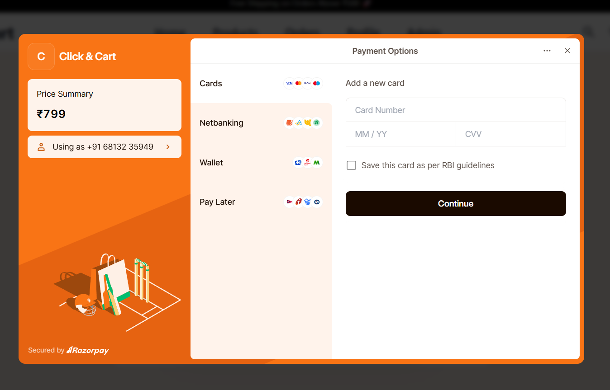
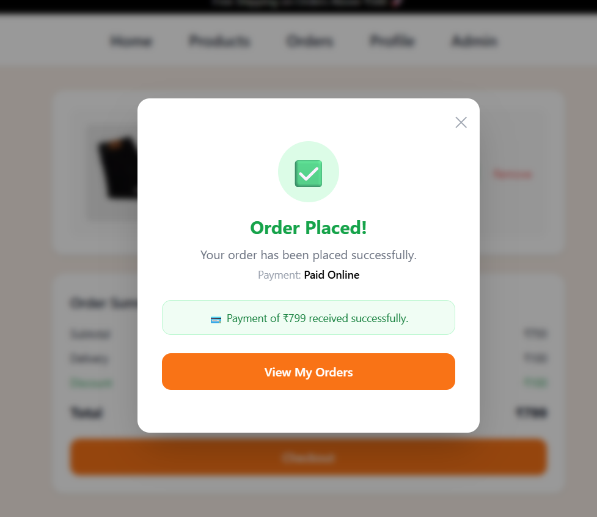
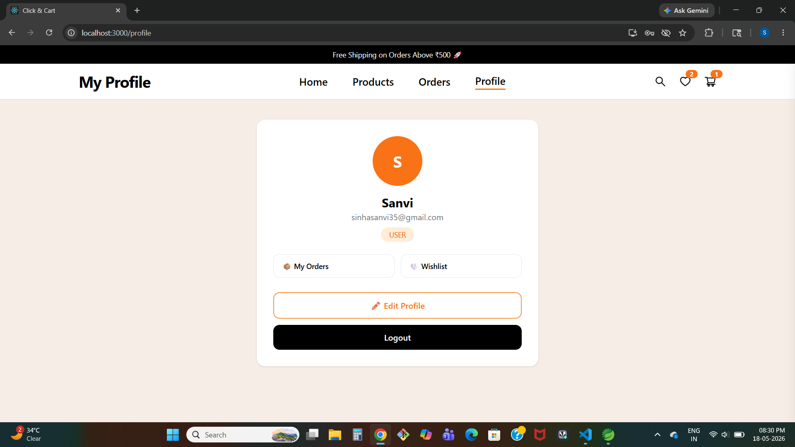
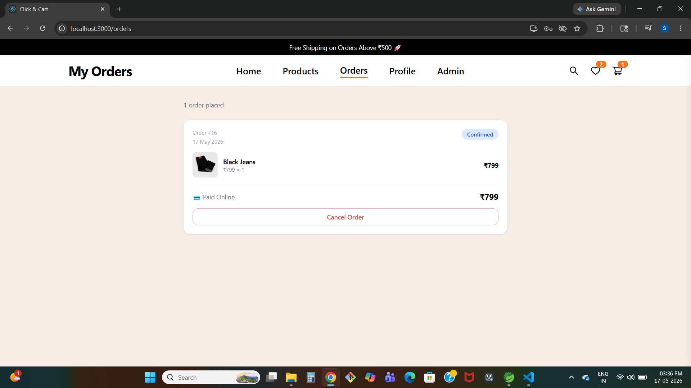
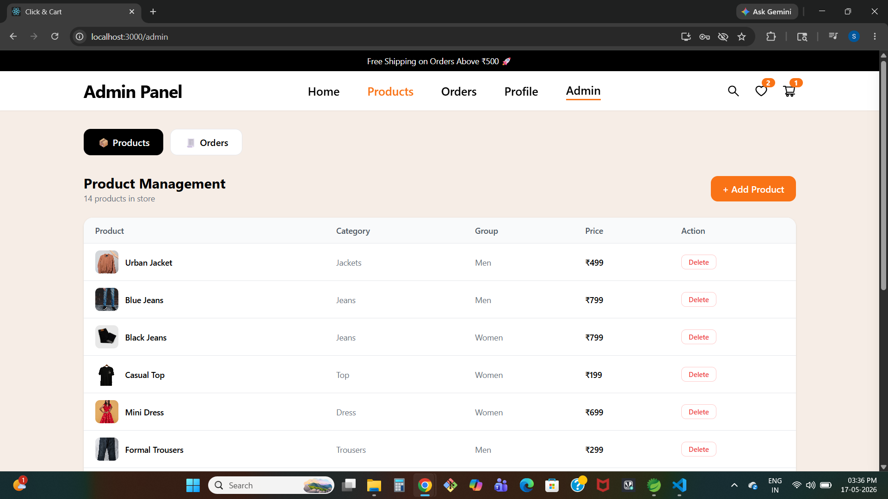
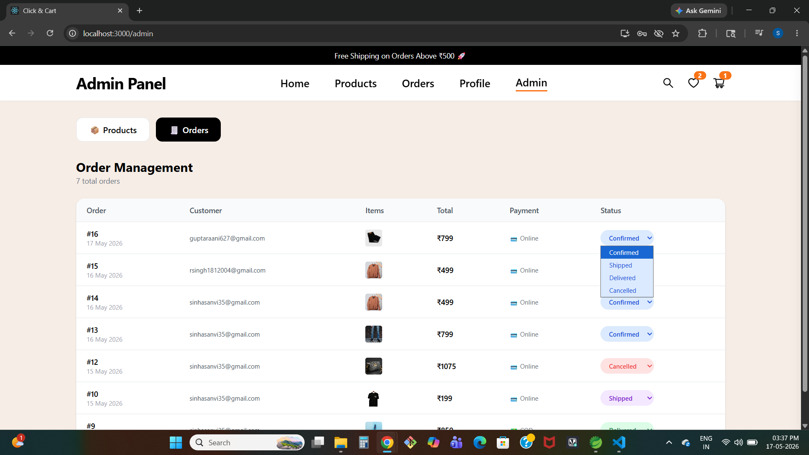

<h1 align="center">Click & Cart</h1>

<p align="center">
  Modern Full Stack E-Commerce Platform built with React, Spring Boot, MySQL & Razorpay
</p>

<p align="center">
  
  
  
  
  
  
</p>

---

# ✨ About Click & Cart

Click & Cart is a modern full stack e-commerce platform designed to deliver a smooth and responsive online shopping experience.

The project includes:

- 🛍️ Product browsing & filtering
- ❤️ Wishlist management
- 🛒 Shopping cart system
- 💳 Razorpay payment integration
- 📦 Order tracking
- 👤 User profile management
- 🔐 JWT Authentication
- 🛠️ Admin dashboard for products & orders

The platform is built with a clean UI and scalable backend architecture using Spring Boot and React.

---

# 🚀 Features

## 👤 User Features

- Secure Login & Registration
- JWT Authentication
- Browse Products
- Category Filtering
- Add to Cart
- Wishlist Management
- Razorpay Online Payments
- Order Placement
- Order Tracking
- Profile Management

## 🛠️ Admin Features

- Admin Dashboard
- Product Management
- Add/Delete Products
- Order Management
- Update Order Status
- Monitor Customer Orders

---

# 🧠 Tech Stack

## Frontend

- React.js
- Tailwind CSS
- Axios
- React Router DOM

## Backend

- Spring Boot
- Spring Security
- JWT Authentication
- REST APIs

## Database

- MySQL

## Payment Gateway

- Razorpay Integration

---

# 📂 Project Structure

```bash
clickNcart-eCommerce/
│
├── frontend/
│   ├── src/
│   │   ├── components/
│   │   ├── pages/
│   │   ├── services/
│   │   └── App.jsx
│
├── backend/
│   ├── controller/
│   ├── service/
│   ├── repository/
│   ├── entity/
│   ├── security/
│   └── config/
│
└── screenshots/
```

---

# 📸 Screenshots

## 🏠 Home Page & 🛍️ Products Page

<p align="center">
  
  
</p>


## ❤️ Wishlist & 🛒 Cart

<p align="center">
  
  
</p>


## 💳 Razorpay Payment & ✅ Order Success

<p align="center">
  
  
</p>


## 👤 Profile & 📦 Orders

<p align="center">
  
  
</p>


## 🛠️ Admin Dashboard

<p align="center">
  
  
</p>

---

# 🔒 Security

- JWT Authentication
- Protected Routes
- Spring Security Integration
- Role-based Access
- Secure REST APIs

---

# 💻 Installation & Setup

## 1️⃣ Clone Repository

```bash
git clone https://github.com/sanjanagupta-dev/clickNcart-eCommerce.git
```


## 2️⃣ Frontend Setup

```bash
cd frontend
npm install
npm start
```

Frontend runs on:

```bash
http://localhost:3000
```

## 3️⃣ Backend Setup

```bash
cd backend
mvn spring-boot:run
```

Backend runs on:

```bash
http://localhost:8080
```

---

# 🧪 Test Payment

Use Razorpay test mode for demo payments.

---

# 🌟 Future Enhancements

- Product Reviews & Ratings
- AI Product Recommendations
- Email Notifications
- Coupon System
- Inventory Management
- Analytics Dashboard

---

# 📈 Project Highlights

✅ Full Stack Architecture  
✅ Responsive Modern UI  
✅ Payment Gateway Integration  
✅ Secure Authentication  
✅ Admin Management System  
✅ Real-world E-Commerce Workflow  

---

# 🤝 Contributing

Contributions are welcome.

Fork the repository and create a pull request to improve the project.

---

# 📜 License

This project is created for educational and portfolio purposes.

---

# ⭐ Support

If you like this project, give it a ⭐ on GitHub.

---

<p align="center">
  Built with ❤️ using React, Spring Boot & MySQL
</p>